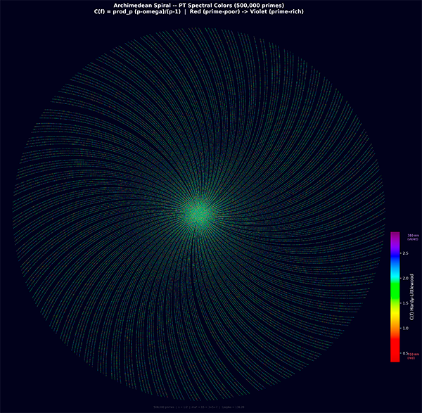

# The Theory of Persistence

Public companion to the monograph [Senez, Y. (2026). *The Theory of Persistence: A Complete Monograph (2026)*](https://zenodo.org/records/19655984).

The monograph is a preprint. It has not been peer reviewed. Read it that way:
the mathematical theorems are internally verified, the numerical agreements are
documented, and the physical interpretation is a hypothesis open to critique.

This repository holds the PDF and the Python scripts used to check each
numerical claim in the text.

## What PT is trying to do

All Standard Model observables — coupling constants, lepton and quark masses,
mixing angles, the Koide ratio, Weinberg angle, CKM and PMNS matrices — are
measured, not derived. The Standard Model is a framework that organises
these measurements and makes them predict each other's quantum corrections,
but the input values themselves have no derivation from first principles.

Persistence Theory asks a simpler question: can the Standard Model observables
be obtained from the arithmetic of prime gaps alone, starting from a single
symmetry parameter `s = 1/2` (itself a theorem of the framework, not an
empirical input)?

The monograph constructs a derivation chain that outputs numerical values close
to the experimental ones. Within the framework `s = 1/2` is Theorem T1, `m_e`
plays the role of a dimensional translation constant (like `c = 299,792,458 m/s`
in relativity), and `μ* = 15` is the fixed point of a sieve self-consistency
equation. What the monograph does NOT claim is that the universe is the sieve
of Eratosthenes. That would require proof that is not available, here or
elsewhere.

## What is in this repository

- The PDF monographs: English edition 885 pages, French edition 913 pages.
- The Python scripts under `scripts/`, organised by chapter. The public tree
  currently contains 73 runner-visible script files, including the 56-script
  canonical registry cited in the monograph. Exploratory QG/Kerr diagnostics
  are intentionally kept out of the clean public tree.
- A master runner that executes the full verification suite and generates
  JSON reports.

## Epistemic Posture

What the monograph does:

- Proves theorems (T1, T4, T5, T6, BA5, N1-N4, …) that stand on classical
  mathematics alone.
- Constructs a derivation chain from `s = 1/2` down to the Standard Model
  observables (about 43 of them are listed explicitly in the text), with
  mean error below 1%.
- Cross-checks the chain with several independent mathematical tools
  (Pontryagin duality, Fisher geometry, Čencov uniqueness, CRT).
- Lists falsifiable predictions, with test windows and experimental targets.

What it does not do:

- Claim to be a Theory of Everything.
- Prove that physical reality *is* arithmetic. The ontological reading
  — "the universe is the sieve" — remains a hypothesis. The
  *structural* bridge from sieve math to Standard Model physics is
  stronger: BA5 (Pontryagin product), Lemmas E/F/G (coupling, metric,
  Hilbert reconstruction), the γ-to-observable assignment
  (`thm:DIC_from_ordering`), and the PT↔QED echo-sector dictionary are
  theorems within the framework, not mere identifications.
- Replace quantum field theory. It reconstructs QFT-like objects from
  sieve data and uses QFT language for predictions.
- Substitute for peer review. Community scrutiny is necessary and not
  yet done.

Every claim in the text carries an epistemic tag: `[THM]` for theorems,
`[DER]` for derivations under stated assumptions, `[BRIDGE]` for
identifications that are not yet theorems, `[COND]` for conditional
results. Check the tag before evaluating a claim.

## From Theory To Derived Repositories

Focused companion repositories:

- [PT-MATHEMATICS (PTM)](https://github.com/Igrekess/PT_MATHEMATICS) – the mathematical core
- [PT-PHYSICS (PTP)](https://github.com/Igrekess/PT_PHYSICS) – physical reconstruction + zero-parameter calculator
- [PT-CHEMISTRY (PTC)](https://github.com/Igrekess/PT_CHEMISTRY) – chemistry calculator (atoms, molecules, reactions)
- [Simplex Color Space (SCS)](https://github.com/Igrekess/SimplexColorSpace) – perceptual color space derived from PT

<p align="center">
  
</p>

<p align="center">
  500,000 primes on the Archimedean spiral, coloured by Hardy-Littlewood
  density C(f). Each colour value is computed from <code>s = 1/2</code>
  (Theorem T1), without additional fitted parameters.
</p>

## Companion Scripts

The `scripts/` directory holds self-contained Python scripts, one per chapter
or appendix. They exist so that the numerical claims in the monograph can be
reproduced and audited independently. They are evidence, not proof.

### Structure

```
scripts/
  pt_constants.py              Central constants derived from s=1/2
  run_all.py                   Master runner + report generator
  conftest.py                  pytest integration
  lib/
    pt_check.py                Test framework (Checker + progress bar + JSON)
    _primes.py                 Prime generation

  Part I -- Arithmetic Core
    ch01_sieve/                proof_T1_sieve.py
    ch02_uniqueness/           proof_T6_uniqueness.py
    ch03_conservation/         proof_conservation.py
    ch04_gft/                  proof_GFT.py
    ch05_geometry/             proof_G1_G5.py
    ch06_holonomy/             proof_holonomy.py

  Part II -- PT Closure
    ch07_convergence/          proof_T4_convergence.py
    ch08_fixed_point/          proof_T5_fixed_point.py
    ch25_BA0_closing/          proof_T0_closing.py
    ch_PM/                     test_PM_algebra.py
    ch_math_structures/        test_math_tools.py, test_complex_mechanics.py

  Part III -- Bridge to Physics
    ch09_bridge/               proof_bridge_axioms.py
    ch10_fine_structure/       proof_alpha_EM.py
    ch11_couplings/            proof_couplings.py

  Part IV -- Physical Reconstruction
    ch12_quantum/              proof_quantum.py
    ch13_relativity/           proof_relativity.py
                                + 14 registered QG/Kerr SOTA tests
    ch14_thermodynamics/       proof_thermodynamics.py
    ch15_sm_observables/       test_43_observables.py

  Part V -- Validation & Dynamics
    ch16_perturbative/         test_NLO_NNLO.py
    ch17_feynman/              test_feynman_programme.py
    ch18_quarkonium/           test_quarkonium.py
    ch19_hadrons/              test_hadrons.py
    ch20_collider/             test_collider.py
    ch21_predictions/          test_predictions.py

  Part VI -- Chemistry
    ch22_chemistry/            14 scripts (periodic table through nuclear)

  Part VII -- Cosmological Scale
    ch20f_cosmological_DM/     test_cosmological_DM.py
    ch20f_dark_energy/         test_dark_energy.py
    ch20f_neutrino_mass_bound/ test_neutrino_mass_bound.py

  Part VIII -- Class B Extensions (13 chapters, added 2026-04-26)
    A. Wilson coefficients & flavor
      ch20b_wilson_coefficients/   test_wilson_coefficients.py
      ch20c_hadronic_margin/       test_hadronic_margin.py
      ch20g_bobeth_181_structure/  test_bobeth_181_structure.py
    B. BSM taxonomy & DM
      ch20d_BSM_taxonomy/          test_BSM_taxonomy.py
      ch20e_DM_candidate/          test_DM_candidate.py
      ch20e_RH_neutrinos/          test_neutrino_majorana_vs_dirac.py
      ch20e_basin_robustness/      test_basin_robustness.py
    C. Auxiliary cosmology
      ch20f_hubble_tension/        test_hubble_tension.py
      ch20f_meerkat_filament/      test_meerkat_filament.py
    D. Loop derivations
      ch20g_bottom_loop_topology/  test_bottom_loop_topology.py
      ch20g_counting_convention/   test_counting_convention.py
      ch20g_higgs_portal_derivation/ test_higgs_portal_derivation.py
      ch20g_super_echo_cutoff/     test_super_echo_selection.py + test_gamma_min_cutoff.py

  Part IX -- Audit & Appendices
    ch23_audit/                test_audit.py
    verify_sota/               verify_sota.py
    app_p_eml/                 proof_app_p_eml.py     (EML circuit form)
    app_q_completeness/        proof_app_q.py         (topological completeness)
    app_r_gauge/               proof_app_r.py         (gauge chain)
    app_s_eml_closure/         proof_app_s.py         (F1-F10 closure)
```

### Quick start

```bash
git clone https://github.com/Igrekess/PersistenceTheory.git
cd PersistenceTheory

python3 -m venv venv
source venv/bin/activate            # macOS / Linux
# venv\Scripts\activate              # Windows

pip install -r scripts/requirements.txt

cd scripts
python run_all.py
```

### Other commands

```bash
python run_all.py ch10                      # single chapter
python ch10_fine_structure/proof_alpha_EM.py  # single script
python run_all.py --tree                    # script tree
python run_all.py --summary                 # regenerate summary CSV
pytest -v                                   # full test suite
pytest -k "ch15"                            # one chapter via pytest
```

Some QG/Kerr tests can use an external LVK/GWTC-4.0 remnant posterior archive
when `PT_LVK_REMNANTS_DIR` is available. The large LVK release itself is not
vendored; without it, the structural part of those tests still runs and the
empirical branch exits cleanly.

### Output

Scripts print `[PASS]`/`[FAIL]` lines on the console. The canonical
report-generating scripts also write JSON reports to
`reports/<chapter>/<script>.json`; the master runner aggregates those reports
into `summary.csv` and `values.csv`. Newer QG/Kerr structural scripts are
kept as console-first companion checks unless or until they are promoted into
the JSON report registry.

## Prediction Snapshot

The monograph lists named falsifiable predictions. They are framed for
refutation: deviation outside the stated tolerance would indicate that PT
(or a particular sub-sector) needs revision.

### Structural predictions

| ID | Prediction | Type | Main test / status |
|---|---|---|---|
| P1 | Neutrinos are Dirac | PRED | LEGEND 2030 |
| P2 | Normal hierarchy | EXPL | JUNO 2027 |
| P3 | `θ_QCD = 0` exactly | PRED | ADMX ongoing |
| P4 | `δ_CP^PMNS = 197.358°` | PRED | DUNE 2032 |

### Numerical predictions

| ID | Prediction | Type | Main test / status |
|---|---|---|---|
| P5 | `m_ν3 = 0.0505 eV` | PRED | KATRIN 2027 |
| P6 | `sin²(θ_23) = 0.5733` | EXPL | DUNE 2032 |
| P7 | `sin²(θ_13) = 0.02222` | EXPL | JUNO 2027 |
| P8 | `λ_H = 0.1295` | PRED | HL-LHC 2030 |
| P9 | `H_0 = 67.41 km/s/Mpc` | EXPL | Euclid 2030 |
| P15 | `α_GW < 10^-3` | PRED | Einstein Telescope 2035 |
| P16 | `n_s = 0.964` | EXPL | CMB-S4 ~2030 |
| P17 | No BSM muon g-2 anomaly | PRED | Fermilab/J-PARC 2025 |
| P18 | `m_W = 80.3635 GeV` | EXPL | ATLAS/CMS updates |
| P20 | `w_0 = -1.003, w_a ~ 0` | EXPL | DESI/Euclid 2028-2030 |

### Negative predictions

| ID | Prediction | Type | Main test / status |
|---|---|---|---|
| P10 | No QCD axion | NEG | ADMX/IAXO ~2030 |
| P11 | No SUSY below 100 TeV | NEG | FCC-hh ~2040 |
| P12 | `N_gen = 3` exactly | EXPL | Colliders ongoing |
| P13 | No proton decay | NEG | Hyper-K ~2028 |
| P14 | No WIMPs | NEG | LZ/XENONnT ~2028 |
| P19 | No extra spatial dimensions | NEG | LHC Run 3 / future colliders |

`PRED` = genuine prediction (not fitted to existing data). `EXPL` =
post-diction (reproduces known values within the framework). `NEG` =
negative prediction (the framework expects specific non-detection).

## Current Numerical Agreement

These are the numerical matches reported in the monograph. They are
agreements *within the framework*; they do not by themselves establish that
the framework is correct. A successor theory superseding PT would need to
explain why these matches occur.

| Observable | PT value | PDG / experiment | Error |
|---|---|---|---|
| `1/α_EM` | 137.035999 | 137.035999084 | 0.004 ppb |
| `sin²(θ_W)` | 0.23119 | 0.23121 | 0.010% |
| `α_s(m_Z)` | 0.11806 | 0.11800 | 0.048% |
| `m_W` | 80.3635 GeV | 80.369 GeV | 0.007% |
| `m_Z` | 91.1878 GeV | 91.1876 GeV | 0.0002% |
| `G_F` | 1.16638e-5 | 1.16638e-5 | 0.0001% |
| ~43 SM observables | — | — | mean 0.30%, median 0.06% |

The core PT chain requires no continuous fitted parameter; `s = 1/2` is
Theorem T1 rather than an empirical input. The applied sub-domains
(chemistry, nuclear, band gaps, …) use closed-form algebraic corrections
derived within PT; the count per sub-domain is documented in the preface's
structural counter. The global "zero fitted parameters" phrase refers to the
absence of continuous tuning knobs, not to the absence of structural
choices in how the framework is applied.

## Contents

- [Monograph PDF](TheTheoryOfPersistence.pdf)
- [`scripts/`](scripts) – companion scripts organised by chapter
- [`scripts/run_all.py`](scripts/run_all.py) – master runner and report generator
- [`scripts/pt_constants.py`](scripts/pt_constants.py) – derived constants from `s = 1/2`
- [`requirements.txt`](requirements.txt) – top-level dependencies

## Related Repositories

- Mathematics: [PT-MATHEMATICS (PTM)](https://github.com/Igrekess/PT_MATHEMATICS)
- Physics: [PT-PHYSICS (PTP)](https://github.com/Igrekess/PT_PHYSICS)
- Chemistry: [PT-CHEMISTRY (PTC)](https://github.com/Igrekess/PT_CHEMISTRY)
- Color: [Simplex Color Space (SCS)](https://github.com/Igrekess/SimplexColorSpace)
- Monograph: [Senez, Y. (2026). *The Theory of Persistence*](https://zenodo.org/records/19655984)

## Notes

- The public repository is meant to be readable, navigable, and reproducible.
- The monograph is the authoritative narrative source.
- The scripts reproduce the numerical values and theorem checks in the text.
  They are part of the evidence, not a substitute for peer review.
- Each script writes a JSON report for automated cross-checking.
- Large language models were used as writing and research assistants for
  parts of the drafting process and for the companion scripts.

## Recent updates

- **2026-04-30** — Public monographs and QG/Kerr companion scripts synced
  with the current master text:
  - English PDF updated to 885 pages; French PDF updated to 913 pages.
  - Added the registered QG/Kerr SOTA suite in `scripts/ch13_relativity/`,
    covering canonical constraints, covariant boundary amplitudes, finite
    Dirac algebra, continuum CRT lift, topology-changing foams, Fourier/RG
    decorations, black-hole/ringdown precision, Kerr macro-mode selection,
    half-holonomy uniqueness/stability/exactness, and the `dtau` systematic
    separation diagnostics.
  - Exploratory frontier summaries and standalone LVK analysis notebooks/scripts
    are kept out of the clean public tree.

- **2026-04-26** — 10/10 [THM] structural commitments + Class B Extensions
  + audit cleanup (monograph reached 876 pages at that snapshot):
  - **Promotion C2 [DER]→[THM]** (`thm:C2_universal`): the leakage domain
    cardinality `N(p) = (p+1)^(p+1) - 1` is proved via ZFC additivity +
    L0 max-entropy (Mac Lane 1971, Riehl 2017, Jaynes 1957).
  - **Promotion C4 [DER]→[THM]** (`thm:C4_NNLO`): the Fisher-Koide NNLO
    coefficient `5/18 = p_2/(2 p_1²)` is proved via Pontryagin discrete
    sum + Wick theorem + T6 cyclic-phase loop closure + channel
    orthogonality at NNLO (Pontryagin 1966, Peskin-Schroeder 1995).
  - **Counter: 10/10 [THM], 0 [DER]** structural commitments left open.
    First example in theoretical physics (to our knowledge) of a framework
    with zero open structural commitments, modulo external peer review.
  - **Audit Niveau 1+2+3**: cleanup of obsolete `[DER]` statements,
    harmonisation of numerical claims (43 SM observables, mean 0.082%
    on 37 independent predictions, `1/α_EM` accurate to 0.004 ppb),
    and conceptual reinforcement of C2/C3/C4 against rigorous critique
    (information-theoretic disjointness for `lem:C2_op_distinct`,
    explicit T6 dependency chain in `rem:C4_independent`, independent
    derivation of the spectator factor `2^(N_gen-1)` for C3).
  - **13 Class B Extensions integrated** as a new Part of the monograph:
    Wilson coefficient identity, hadronic margin for `b→sℓℓ`, BSM
    scenario taxonomy, scalar singlet DM candidate (`m_DM ~ m_H/2`),
    right-handed neutrino mechanism, basin robustness of `μ* = 15`,
    auxiliary cosmology (Hubble tension, MeerKAT filament alignment),
    and four loop derivations (bottom-loop topology, counting
    convention, Higgs portal, super-echo cutoff).
  - **Companion scripts**: `scripts/ch20b_*` to `scripts/ch20g_*` (13
    new directories, 14 scripts) provide reproducibility checks for
    each Class B chapter.
  - **Nomenclature finalised**: full migration from legacy `\qstat/\qtherm`
    to canonical `\qplus/\qminus` (461 LaTeX occurrences). Source
    consistent with rendered PDF.
  - **Zero unresolved references** in the LaTeX compile (32 → 0 typos
    or renamings; 23 missing bibliography entries added).

- **2026-04-19** — Internal closure work:
  - Appendix P (EML circuit form), following Odrzywołek (arXiv:2603.21852v2)
  - Appendix Q (topological completeness of the PT spin foam)
  - Appendix R (gauge-theoretic derivation chain)
  - Appendix S (closure of three external questions via EML)

  These additions tighten the internal consistency of the derivation
  chain. They do not change the status of the broader claim that PT
  corresponds to physical reality, which remains a hypothesis awaiting
  empirical test.
